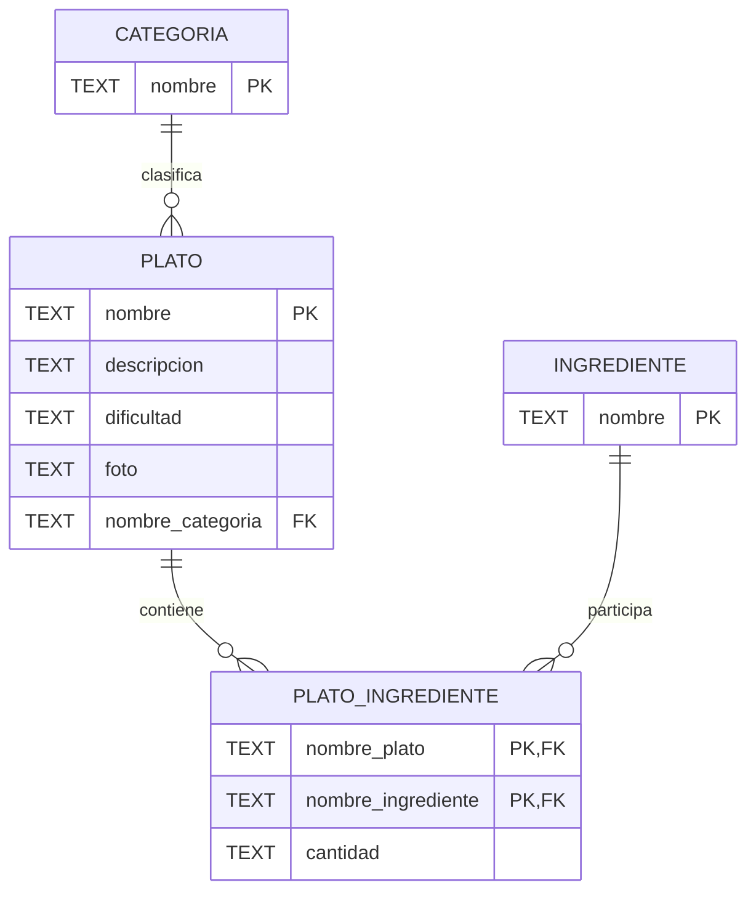

# BASES DE DATOS - Diseno Logico (DER -> Modelo Relacional)

## Resumen rapido
Este proyecto muestra como pasar de un Diagrama Entidad-Relacion (DER) a tablas relacionales listas para implementarse en SQLite.

Caso trabajado: `CATEGORIA`, `PLATO`, `INGREDIENTE` y la tabla puente `PLATO_INGREDIENTE`.

## Objetivo
Traducir un modelo conceptual (lo que existe en el mundo real) a un modelo logico (tablas con PK y FK) sin perder reglas de negocio.

## Analogia simple (para entenderlo facil)
Piensalo como una cocina con archivadores:

- Una **tabla** es un archivador.
- Cada **fila** es una ficha (un registro).
- La **PK** es el numero unico de ficha.
- La **FK** es una referencia a otra ficha en otro archivador.
- Una relacion **1:N** es: una categoria tiene muchos platos.
- Una relacion **N:M** es: un plato usa muchos ingredientes y un ingrediente aparece en muchos platos. Para eso se crea un archivador intermedio (tabla puente).

## Conceptual vs logico vs fisico
- **Conceptual (DER):** que cosas existen y como se relacionan (sin pensar en SQL).
- **Logico:** tablas, columnas, PK, FK, cardinalidades.
- **Fisico:** detalles de implementacion en un motor concreto (tipos de dato, indices, rendimiento, almacenamiento).

## Reglas de transformacion DER -> tablas
1. Cada entidad se convierte en una tabla.
2. Cada atributo se convierte en columna.
3. El identificador de la entidad pasa a PK.
4. Relacion 1:N: la FK va en el lado N.
5. Relacion N:M: se crea una tabla puente con dos FK y PK compuesta.

## Aplicacion al ejemplo
### Entidades
- `CATEGORIA`
- `PLATO`
- `INGREDIENTE`

### Relaciones
- `CATEGORIA 1:N PLATO`
- `PLATO N:M INGREDIENTE` (con atributo `cantidad`)

### Esquema logico final
- `CATEGORIA(nombre PK)`
- `PLATO(nombre PK, descripcion, dificultad, foto, nombre_categoria FK -> CATEGORIA(nombre))`
- `INGREDIENTE(nombre PK)`
- `PLATO_INGREDIENTE(nombre_plato FK -> PLATO(nombre), nombre_ingrediente FK -> INGREDIENTE(nombre), cantidad, PK(nombre_plato, nombre_ingrediente))`

## Diagrama visual (PNG)


Regenerar imagen:

```powershell
powershell -ExecutionPolicy Bypass -File scripts/generar_diagrama.ps1
```

## Diagramas editables para web (DBML por etapas)
Puedes explicar el tema por niveles con estos archivos:

- `diagrams/dbml/01_entidades_base.dbml`: solo entidades y atributos.
- `diagrams/dbml/02_relacion_1N_categoria_plato.dbml`: agrega relacion 1:N.
- `diagrams/dbml/03_relacion_NM_plato_ingrediente.dbml`: explica N:M y tabla puente.
- `diagrams/dbml/04_modelo_logico_completo.dbml`: modelo final completo.
- `diagrams/dbml/05_modelo_completo_explicado.dbml`: version con notas didacticas.
- `diagrams/schema.dbml`: alias del modelo final para uso rapido.

Flujo recomendado para clase/exposicion:
1. Mostrar `01` para explicar entidades.
2. Pasar a `02` para explicar FK en 1:N.
3. Pasar a `03` para explicar por que existe tabla puente en N:M.
4. Cerrar con `04` o `05` como version final.

## Diagrama Mermaid (renderizable en GitHub)


## Herramientas online recomendadas (bonitas y presentables)
1. **dbdiagram.io** (`https://dbdiagram.io`)
   - Pegas DBML o SQL y te genera el diagrama limpio.
   - Ideal para entregas rapidas y exportar imagen.
2. **Mermaid Live Editor** (`https://mermaid.live`)
   - Pegas sintaxis Mermaid y exportas PNG/SVG.
   - Muy util si ya usas GitHub/Markdown.
3. **draw.io / diagrams.net** (`https://app.diagrams.net`)
   - Editor visual para acomodar cajas/flechas manualmente con estilo profesional.

## Implementacion SQL (SQLite)
Script de creacion:

- `sql/schema.sql`

Crear la base local:

```powershell
python -c "import sqlite3; con=sqlite3.connect('db/bases_datos.sqlite'); con.executescript(open('sql/schema.sql', encoding='utf-8').read()); con.close()"
```

## Mini validacion (opcional)
Consultar tablas creadas:

```powershell
python -c "import sqlite3; con=sqlite3.connect('db/bases_datos.sqlite'); cur=con.cursor(); cur.execute(\"SELECT name FROM sqlite_master WHERE type='table' ORDER BY name\"); print([r[0] for r in cur.fetchall()]); con.close()"
```

## Errores comunes que debes evitar
- Poner una relacion N:M sin tabla puente.
- Olvidar la PK compuesta en tabla puente.
- Crear FK hacia columnas que no son PK/UNIQUE.
- No activar control de FK en SQLite cuando haces pruebas (`PRAGMA foreign_keys = ON`).

## Conclusiones
El diseno logico es el puente entre la idea del negocio y la base real. Si este paso queda claro, el SQL sale ordenado, mantenible y sin redundancias graves.

## Fuentes web consultadas
- PostgreSQL docs - restricciones PK/FK: https://www.postgresql.org/docs/current/ddl-constraints.html
- SQLite docs - `PRAGMA foreign_keys`: https://www.sqlite.org/pragma.html#pragma_foreign_keys
- Microsoft Learn - normalizacion en diseno de BD: https://learn.microsoft.com/en-us/office/troubleshoot/access/database-normalization-description
- Mermaid ER diagrams: https://mermaid.js.org/syntax/entityRelationshipDiagram.html
- DBML / dbdiagram: https://dbml.dbdiagram.io/home/
- dbdiagram.io: https://dbdiagram.io/home
